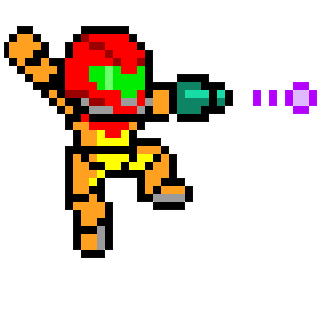

# Metroid item collection guide
<div style="text-align:center">
  
</div>

Follow your journey, marking the items you've already picked up right on the map!

## How to use?

Navigate to [Metroid Guide site](https://metroidguide.netlify.com), Choose your map and to check the items already collected, just click on it on the map. To remove a check from the map, simply click on it again. The checks will be saved in your browser's localStorage, so if you close or refresh, you will not lose your checks

## Development

First, run the development server:

```bash
yarn dev
```

Open [http://localhost:3000](http://localhost:3000).
